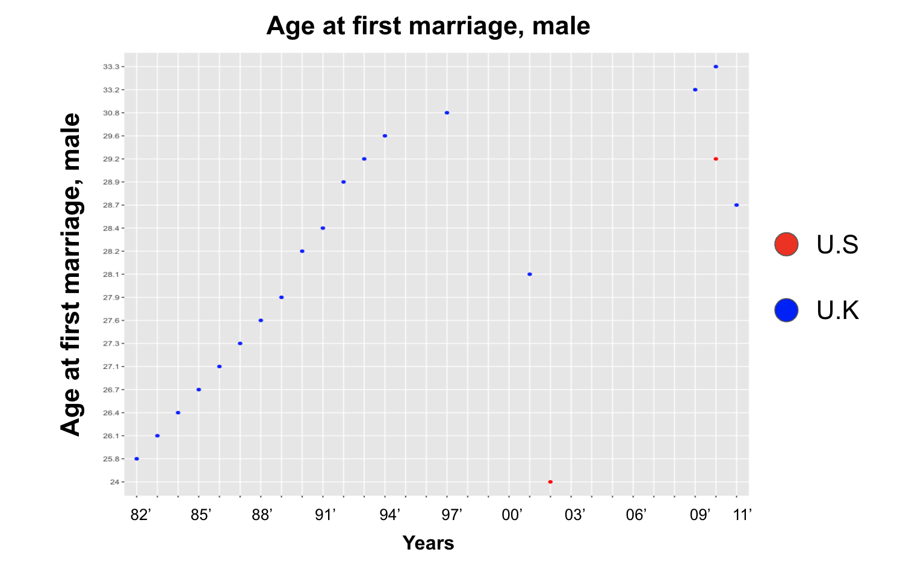
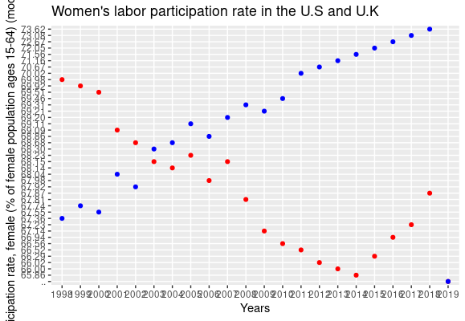
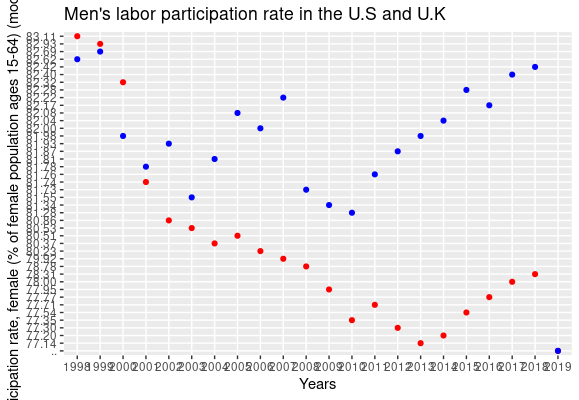
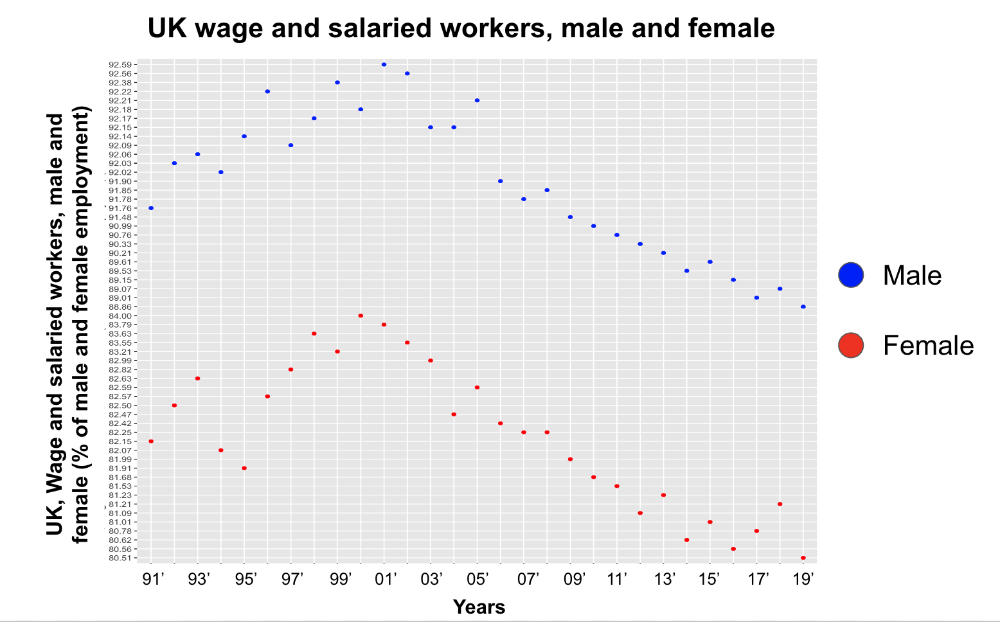
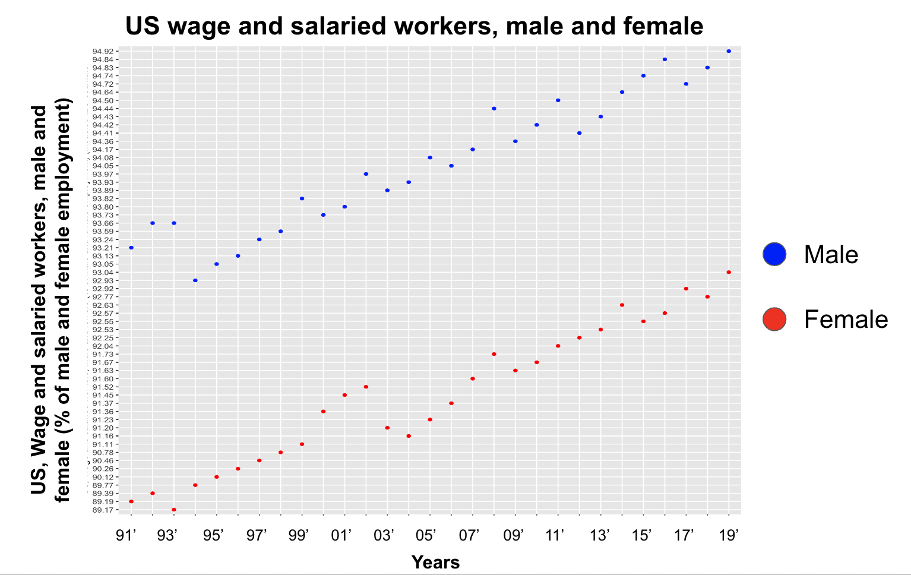

# Lab 06 :: CS301

## Date

20 March 2023

Link to Source: [dataset](https://datacatalog.worldbank.org/search/dataset/0037654/Gender-Statistics)?

## Names of all members 

Tuguldur Gantulga
Julien Voisey

## Group Name

tugi-julien

## Q1: Which dataset (please give the filename too) are you using from the downloaded package from the World Bank?

We used dataset from the gender statistics.

## Describe the data.

The data had the female side of the things and the male of the things. The data described age at first marriage between males and females.

## Q2: Complete an analysis to show evidence to confirm or refute the decline in marriage rates for two countries. 

### Justify the Variables or Indicator Names that you chose for this analysis. 

The variable we used was 'Age at first marriage, female', and it was a good variable to use. The variable is able to help us understand if there is an increasing or decreasing rate in marriage rates because if people are getting married at an older age, we can assume that males and females are more focused on their careers and are looking for more independence, so they are less likely to get married. This will result in people getting married at an older age, as less younger people are getting married.

### What are the limitations to these variables in terms of addressing the above question? For instance, what part of the above question can these variables address? What parts of the above question can they _not_ address?

Age at first marriage had a lot of limitations as there was not enough data for the US to determine if people are getting married at an older age or not. This means that it is difficult to conclude if the marriage rates for males and females are going down.

### Describe your findings and their conclusions from your analysis.

We can see the decline in the marraige rate due to the increase of the age when people are getting married for both U.S and U.K

---

## Q3: Complete an analysis to show evidence to confirm or refute the narrowing gender wage gap

I would try to confirm the narrowing gender gap

### Justify the Variables or Indicator Names that you chose for this analysis.

Women’s participation rate in the U.S. and the U.K.
We also used the number of female salaried workers.

#### What are the limitations to these variables in terms of addressing the above question?

I do not think the participation rate is a good variable when it comes to addressing the gender wage gap. Moreover, obviously, we have a number of female workers and we could definitely see that their numbers are increasing. However, to critique this their labor participation rate was much lower than men’s. Although we concluded that men had the higher participation rate. We could easily notice that women’s growth had much more growth between 2010 and 2019. It grew from 62% to 64%. However, male-only grew from 80 to 80.3%.

Women’s unemployment rate was slightly higher than the men’s unemployment rate
As more years pass, less women are being unemployed

---

## Q4: Complete an analysis to show evidence to confirm or refute the preference (or cultural) shift toward market work

### Justify the Variables or Indicator Names that you chose for this analysis.

For this analysis, I chose the U.S. wage and salaried workers male and female (% of male and female employment).

Also, I chose the same variable for the U.K. too. Because I needed two countries

#### What are the limitations to these variables in terms of addressing the above question? For instance, what part of the above question can these variables address? What parts of the above question can they _not_ address?

Although I could have used the labor participation increase to explain the increase in the workforce when it comes to women. However, we used that on question number three. Thus, I used the salaried workers male and female because if you look at the graph it shows an increase. 

Another limitation is that there could be much better variables that could explain what happened.

### Describe your findings and their conclusions from your analysis.

To conclude my findings, although both findings had a positive trend and a correlation, things did not look good in the U.K after 2008. We could see that women suffered more when it comes to unemployment in the U.K more than the men because the slope is steeper.

---

## Q5: Complete an analysis to show evidence to confirm or refute the change in women’s bargaining power within the household.

Using our evidence, we confirm a change in the women’s bargaining power within the household. In the UK, the Female share of employment in senior and middle management (%) was increasing until, in 2011, it dropped, as female workers were three times more likely to get fired in 2011 than male workers due to discrimination. In the US, the rate has increased from 37% to 42% for the past 15 years as more women are getting higher education.

### Justify the Variables or Indicator Names that you chose for this analysis. 

We used the Female share of employment in senior and middle management (%) variable for the US and the UK as it shows how much more females are getting higher level jobs. As females are getting higher level jobs, they have more bargaining power in the household, which impacts their bargaining power in their household.

#### What are the limitations to these variables in terms of addressing the above question? 

The limitation to this variable is that the gender wage gap has many other factors which impact the bargaining power of women within the household, such as discrimination.

### Describe your findings and their conclusions from your analysis.

Our findings show that the US and the UK are on a steady trend going up for more women receiving jobs in senior and middle management positions. Although the UK significantly dropped in 2011 due to discriminatory factors, these trends show us that more women are receiving better paid jobs which means they will have more income. As more women have more money, they have more purchasing power within the household they live in. This means they have more influence over purchasing decisions for their household, which gives them more bargaining power.

---

(Did you remember to place the names of yourself and your group members above?)

